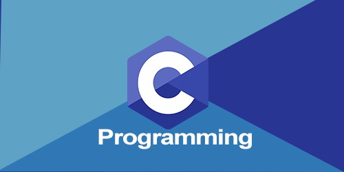

# A Low Level Programming and Alogrithm Repo
### A Holberton and ALX programming curriculum

# Introduction
This repository contains programs in C programming language majorly with a touch of shell scripting

It will cover the following concepts:
- Compiler and Compilation flags
- Basic and Advanced syntax in C programming
- Makefiles
- Shell scripting
- Linux OS
- A touch of Information Security
- Algorithms
- Creating custom libraries
- Etc..

## Table of Contents
* [Introduction](#Introduction)
* [Prerequisites](# Prerequisites)
* [Projects](#Projects)
* [Acknowledgement](#Acknowledgement)

# Prerequisites
* Ubuntu 14.04 LTS or later version (used Ubuntu 20.04 LTS)
* gcc Compiler
* Linux OS
* CS knowledge
* Computer proficiency

